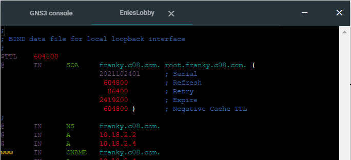
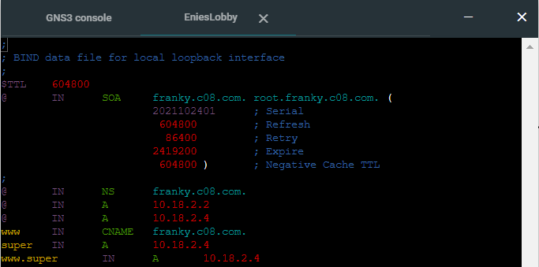
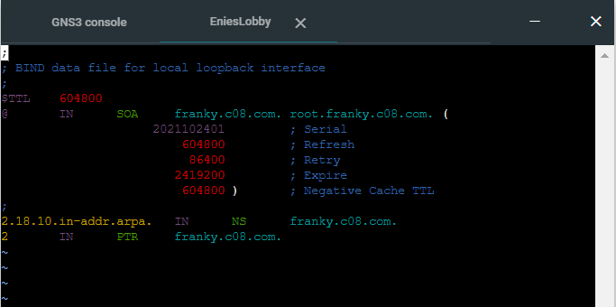
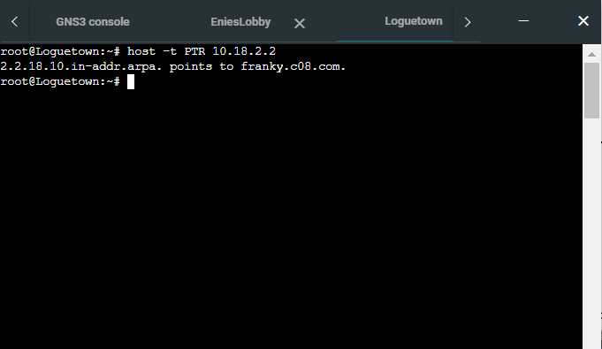
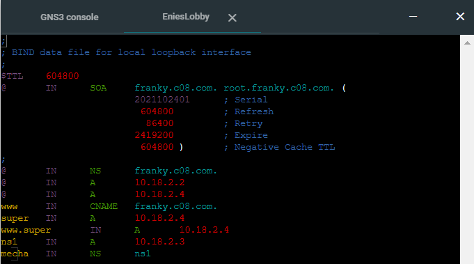
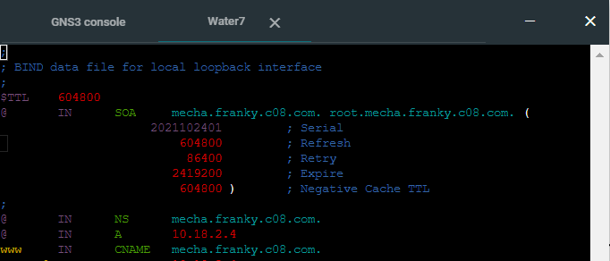
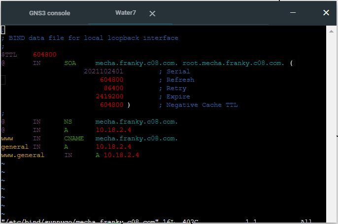
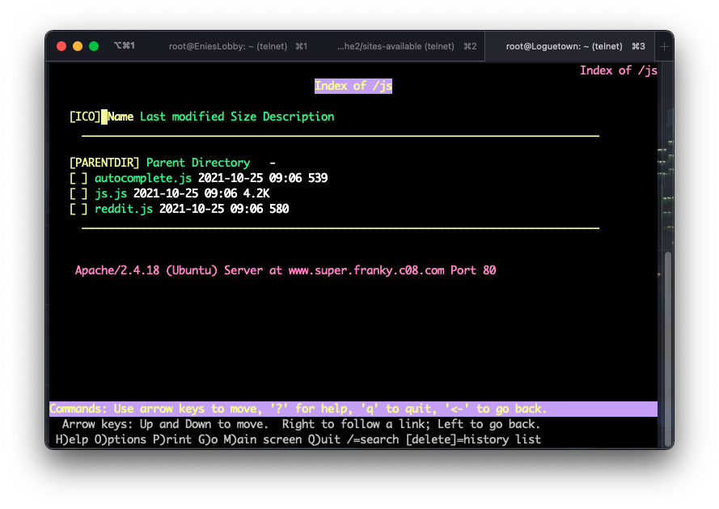

# Jarkom-Modul-2-C08-2021

Berikut adalah laporan resmi Praktikum Jaringan Komputer Modul 2 tahun 2021

Anggota Kelompok C08 :

- 05111940000100 - Muhammad Raihan
- 05111940000208 - Inez Yulia Amanda
- 05111940000209 - Refaldyka Galuh Pratama

## 1. EniesLobby akan dijadikan sebagai DNS Master, Water7 akan dijadikan DNS Slave, dan Skypie akan digunakan sebagai Web Server. Terdapat 2 Client yaitu Loguetown, dan Alabasta. Semua node terhubung pada router Foosha, sehingga dapat mengakses internet
1. Klik `Servers` di kiri atas
2. Klik `local`
3. Klik `Add blank project`
4. Masukkan nama `project` 
5. Klik `Add project`
6. Klik tombol `Add a node` di samping kiri
7. Lalu tarik `ubuntu-`1 ke area kosong di halaman
8. Tunggu sampai loading selesai
9. Jika berhasil akan menampilkan tampilan yang mirip dengan ini
    
10. Klik kanan dan `change hostname` menjadi `Foosha`
    
11. Klik kanan lagi dan `change symbol` menjadi symbol `router`
    
12. Lakukanlah langkah 6 hingga 10 untuk `LogueTown`, `Alabasta`, `EniesLobby`, `Water7`, dan `Skypie`. Sehingga menjadi seperti pada gambar
    
13. Jika sudah klik tombol `Add a node` di samping kiri lagi
14. Tarik `NAT` dan dua `Switch` ke area kosong
    
15. Gunakan menu `Add a Link` dan tambahkan link seperti pada gambar berikut pada setiap node
    
16. Lalu kita setting network masing-masing node dengan fitur Edit network configuration seperti yang ditunjukkan disini sebelumnya, kita bisa menghapus semua settingnya dan  mengisi dengan settingan di bawah
  - Foosha
  ```
  auto eth0
iface eth0 inet dhcp

auto eth1
iface eth1 inet static
	address 10.18.1.1
	netmask 255.255.255.0

auto eth2
iface eth2 inet static
	address 10.18.2.1
	netmask 255.255.255.0
  ```
  - Loguetown
  ```
  auto eth0
iface eth0 inet static
	address 10.18.1.2
	netmask 255.255.255.0
	gateway 10.18.1.1
  ```
  - Alabasta
  ```
  auto eth0
iface eth0 inet static
	address 10.18.1.3
	netmask 255.255.255.0
	gateway 10.18.1.1
  ```
  - EniesLobby
  ```
  auto eth0
iface eth0 inet static
	address 10.18.2.2
	netmask 255.255.255.0
	gateway 10.18.2.1
  ```
  - Water7
  ```
  auto eth0
iface eth0 inet static
	address 10.18.2.3
	netmask 255.255.255.0
	gateway 10.18.2.1
  ```
  - Skypie
  ```
  auto eth0
iface eth0 inet static
	address 10.18.2.4
	netmask 255.255.255.0
	gateway 10.18.2.1
  ```
17. Restart semua node
18. Topologi yang dibuat sudah bisa berjalan secara lokal, tetapi kita belum bisa mengakses jaringan keluar. Maka kita perlu melakukan beberapa hal.
19. Ketikkan `vim .bashrc` pada router `Foosha` dan masukkan command berikut
   ```
   iptables -t nat -A POSTROUTING -o eth0 -j MASQUERADE -s 10.18.0.0/16
   ```
20. Ketikkan command `cat /etc/resolv.conf` di `Foosha` kemudian ingat ingat nameservernya
21. Pada node LogueTown, Alabasta, EniesLobby, Water7, dan Skypie. Ketikkan command `vim .bashrc` kemudian masukkan command 
   ```
   echo nameserver 192.168.122.1 > /etc/resolv.conf
   ```
22. Jalankan ulang projectnya
23. Semua node sekarang seharusnya sudah bisa melakukan ping ke google, yang artinya adalah sudah tersambung ke internet
## 2. Buat website utama dengan mengakses franky.c08.com dengan alias www.franky.c08.com pada folder kaizoku
1. Buka WebConsole `EniesLobby`, dan `Water7`. Ketikkan `vim .bashrc` dan masukkan command berikut
  ```
  apt-get update
  apt-get install bind9 -y
  ```
2. Buka WebConsole `LogueTown` ,dan `Alabasta`. Ketikkan `vim .bashrc` dan masukkan command berikut
 ```
 apt-get update
 apt-get install dnsutils -y
 ```
3. Jalankan ulang projectnya
4. Masukkan command berikut pada `EniesLobby`
  ```
 vim /etc/bind/named.conf.local
  ```
5. Isikan configurasi zone domain **franky.c08.com** sesuai dengan syntax berikut:
  ```
  zone "franky.c08.com" {
	type master;
	file "/etc/bind/kaizoku/franky.c08.com";
};
  ```
6. Buat folder **kaizoku** di dalam /etc/bind
  ```
  mkdir /etc/bind/kaizoku
  ```
7. Copykan file `db.local` pada path `/etc/bind` ke dalam folder **kaizoku** yang baru saja dibuat dan ubah namanya menjadi **franky.c08.com**
  ```
  cp /etc/bind/db.local /etc/bind/kaizoku/franky.c08.com
  ```
8. Buka file **franky.c08.com** dan edit seperti gambar berikut dengan IP 10.18.2.2 dan IP 10.18.2.4 serta record CNAME `www`
   
9. Restart bind9 dengan command `service bind9 restart`
10. Comment nameserver `Foosha` pada `etc/resolv.conf` di node `LogueTown` dan `Alabasta` kemudian tambahkan `nameserver 10.18.2.2`
11. Kemudian test dengan cara ping IP `franky.c08.com` dan `www.franky.c08.com` pada `Loguetown` atau `Alabasta`

## 3. Buat subdomain super.franky.c08.com dengan alias www.super.franky.c08.com yang diatur DNS nya di EniesLobby dan mengarah ke Skypie
1. Jalankan command `vim /etc/bind/kaizoku/franky.c08.com` dan edit seperti gambar berikut untuk membuat subdomain dan aliasnya
  
2. Restart bind9 dengan command `service bind9 restart`
3. Kemudian test dengan cara ping IP `super.franky.c08.com` dan `www.super.franky.c08.com` pada `Loguetown` atau `Alabasta`

## 4. Buat juga reverse domain untuk domain utama
1. Jalankan command `vim /etc/bind/named.conf.local` pada `EniesLobby`
2. Lalu tambahkan konfigurasi berikut ke dalam file `named.conf.local` dibawah zone `franky.c08.com`. Tambahkan reverse IP `10.18.2` yaitu `2.18.10`. 
 ```
 zone "2.18.10.in-addr.arpa" {
    type master;
    file "/etc/bind/kaizoku/2.18.10.in-addr.arpa";
};
 ```
3. Copykan file `db.local` pada path `/etc/bind` ke dalam folder **kaizoku** yang baru saja dibuat dan ubah namanya menjadi **2.18.10.in-addr.arpa**
4. Edit file **2.18.10.in-addr.arpaa** menjadi seperti gambar di bawah ini
  
5. Restart bind9 dengan command `service bind9 restart`
6. Test dengan cara mengetikkan command `host -t PTR "10.18.2.2"`. Jika muncul seperti pada gambar berarti benar.
  
## 5. Buat Water7 sebagai DNS Slave untuk domain utama
1. Edit file `/etc/bind/named.conf.local` pada `EniesLobby` tepatnya pada zone `franky.c08.com` dan sesuaikan dengan syntax berikut
 ```
 zone "franky.c08.com" {
        type master;
        notify yes;
        also-notify { 10.18.2.3; };
        allow-transfer { 10.18.2.3; };
        file "/etc/bind/kaizoku/franky.c08.com";
};
 ```
2. Restart bind9 `EniesLobby` dengan command `service bind9 restart`
3. Kemudian buka file `/etc/bind/named.conf.local` pada `Water7` dan tambahkan syntax berikut:
 ```
 zone "franky.c08.com" {
    type slave;
    masters { 10.18.2.2; };
    file "/var/lib/bind/franky.c08.com";
};
 ```
4. Restart bind9 `Water7` dengan command `service bind9 restart`
5. Test dengan cara mematikan bind9 pada `EniesLobby` yaitu dengan mengetikkan comman `service bind9 stop`
6. Di node `LogueTown` dan `Alabasta` tambahkan `nameserver 10.18.2.3`.
7. Lalu ping ke semua domain atau subdomain yang telah dibuat.

## 6. Setelah itu terdapat subdomain mecha.franky.c08.com dengan alias www.mecha.franky.c08.com yang didelegasikan dari EniesLobby ke Water7 dengan IP menuju ke Skypie dalam folder sunnygo
1. Pada `EniesLobby`, edit file `/etc/bind/kaizoku/franky.c08.com` dan ubah menjadi seperti di bawah ini.
  
2. Kemudian edit file `/etc/bind/named.conf.options` pada `EniesLobby`.
3. Kemudian comment `dnssec-validation auto;` dan tambahkan `allow-query{any;};`
4. Restart bind9 `EniesLobby` dengan command `service bind9 restart`
5. Lakukan langkah kedua dan ketiga pada `Water7`
6. Lalu edit file `/etc/bind/named.conf.local` pada `Water7` tambahkan syntax berikut:
 ```
 zone "mecha.franky.c08.com" {
        type master;
        file "/etc/bind/sunnygo/mecha.franky.c08.com";
};
 ```
7. Kemudian buatlah folder `sunnygo` pada `Water7` dengan mengetikkan command `mkdir /etc/bind/sunnygo`
8. Dan ketikkan command `cp /etc/bind/db.local /etc/bind/sunnygo/mecha.franky.c08.com` pada `Water7`
9. Kemudian edit file `mecha.franky.c08.com` pada `Water7` menjadi seperti dibawah ini
  
10. Restart bind9 `Water7` dengan command `service bind9 restart`
11. Kemudian test dengan cara ping IP `mecha.franky.c08.com` dan `www.mecha.franky.c08.com` pada `Loguetown` atau `Alabasta`
## 7. Buatkan subdomain melalui Water7 dengan nama general.mecha.franky.c08.com dengan alias www.general.mecha.franky.c08.com yang mengarah ke Skypie
1. Jalankan command `vim /etc/bind/kaizoku/mecha.franky.c08.com` pada `Water7` dan edit seperti gambar berikut untuk membuat subdomain dan aliasnya
  
2. Restart bind9 `Water7` dengan command `service bind9 restart`
3. Kemudian test dengan cara ping IP `franky.c08.com` dan `www.franky.c08.com` pada `Loguetown` atau `Alabasta`
## 8. Konfigurasi Webserver dengan domain www.franky.c08.com dan DocumentRoot pada /var/www/franky.c08.com.
1. Pindah ke direktori `/etc/apache2/sites-available` lalu *copy* file **000-default.conf** ke **franky.c08.com.conf** dengan perintah 
    ```
    cp /etc/apache2/sites-available/000-default.conf /etc/apache2/sites-available/franky.c08.com.conf
    ```
2. Edit file **franky.c08.com.conf** sehingga menjadi
    
3. Aktifkan konfigurasi `a2ensite franky.c08.com.conf` 
4. Pindah ke direktori `/var/www` lalu download file dengan command `git config --global http.sslVerify false` lalu `git clone https://github.com/FeinardSlim/Praktikum-Modul-2-Jarkom.git` dan unzip file
    
5. Restart apache dengan `service apache2 restart`
6. Ketika mengakses **www.franky.c08.com** atau **www.franky.c08.com/index.php/home** maka akan mendapat tampilan seperti berikut
    

## 9. Mengubah url www.franky.c08.com/index.php/home dapat menjadi menjadi www.franky.c08.com/home
1. Jalankan perintah `a2enmod rewrite`
2. Melakukan konfigurasi pada server dengan menambahkan
    ```
    <Directory /var/www/semeruc02.pw>
        Options +FollowSymLinks -Multiviews
        AllowOverride All
    </Directory>
    ```
    pada **franky.c08.com.conf** seperti berikut
    
3. Pindah ke direktori `/var/www/franky.c08.com` dan buat file **.htaccess** lalu masukkan 
    ```
    RewriteEngine On
    RewriteCond %{REQUEST_FILENAME} !-d
    RewriteRule ^home$ index.php/home
    ```
    seperti berikut
    
4. Restart apache dengan `service apache2 restart`
5. Ketika mengakses **www.franky.c08.com/home** maka akan mendapat tampilan seperti berikut
    

## 10. Konfigurasi subdomain www.super.franky.c08.com Setelah itu, pada subdomain www.super.franky.c08.com, Luffy membutuhkan penyimpanan aset yang memiliki DocumentRoot pada /var/www/super.franky.c08.com.
1. Edit file **franky.c08.com.conf** sehingga menjadi
    
2. Restart apache dengan `service apache2 restart`
3. Ketika mengakses **www.super.franky.c08.com** maka akan mendapat tampilan seperti berikut
    

## 11. Akan tetapi, pada folder /public hanya dapat melakukan directory listing saja.
1. Konfigurasi file **franky.c08.com.conf** dengan menambahkan
    ```
    <Directory /var/www/super.franky.c08.com/public>
        Options +Indexes
    </Directory>
    ```
    sehingga menjadi
    
2. Ketika mengakses **www.super.franky.c08.com/public** maka akan mendapat tampilan seperti berikut
    

## 12. Mengganti error default dari apache menjadi error file 404.html pada folder/error.
1. Menambahkan konfigurasi berikut pada **franky.c08.com.conf**
    ```
    ErrorDocument 404 /error/404.html
    ```
    sehingga menjadi
    
2. Ketika mengakses url invalid seperti **www.super.franky.c08.com/halo** maka akan mendapat tampilan seperti berikut
    

## 13. Konfigurasi virtual host agar dapat mengakses file asset www.super.franky.c08.com/public/js menjadi www.super.franky.c08.com/js.
1. Jika mengakses **www.super.franky.c08.com/public/js** maka mendapatkan tampilan sebagai berikut
    
2. Edit file **franky.c08.com.conf** dengan menambahkan
    ```
    Alias "/js" "/var/www/super.franky.c08.com/public/js"
    ```
    sehingga menjadi
    
- Ketika mengakses **www.super.franky.c08.com/js** maka akan mendapatkan tampilan seperti berikut
    

## 14. Mengatur web www.general.mecha.franky.c08.com hanya bisa diakses dengan port 15000 dan port 15500
Langkah - langkah :
1. Membuat konfigurasi Web Server di /etc/apache2/sites-available/franky.c08.com.conf, tambahkan potongan kode berikut.
```
<VirtualHost *:15000 *:15500>
        ServerName general.mecha.franky.c08.com
        ServerAlias www.general.mecha.franky.c08.com
        ServerAdmin webmaster@localhost
        DocumentRoot /var/www/general.mecha.franky.c08.com
</VirtualHost>
```
2. Tambahkan port yang akan di listen pada /etc/apache2/ports.conf
```
Listen 15000
Listen 15500
```
3. Buat folder baru di /var/www dengan nama general.mecha.franky.c08.com
```
mkdir /var/www/general.mecha.franky.c08.com
```
4. Copy file - file lampiran github ke folder yang telah dibuat
```
cp -R /root/general.mecha.franky/* /var/www/general.mecha.franky.c08.com
```
5. Restart apache2
```
service apache2 restart
```
6. general.mecha.franky.c08.com dan Alias nya sudah bisa diakses melalui client menggunakan Lynx pada port 15000 atau 15500
## 15. Memberi autentikasi pada www.general.mecha.franky.c08.com dengan username luffy dan password onepiece
Langkah - langkah :
1. Tambahkan code berikut pada file /etc/apache2/sites-available/franky.c08.com.conf di bagian web server general.mecha.franky.c08.com
```
        <Directory /var/www/general.mecha.franky.c08.com>
        AuthType Basic
        AuthName "Ga Oleh Iki"
        AuthUserFile /etc/apache2/.htpasswd
        Require valid-user
        </Directory>
```
2. Buat user baru dengan command berikut sehingga memunculkan file .htpasswd pada direktori /etc/apache2
```
htpasswd -c /etc/apache2/.htpasswd luffy
```
3. Akan diminta memasukan password, masukkan 'onepiece'
4. Ketika web server general.mecha.franky.c08.com diakses, akan diminta authentikasi username dan password
## 16. Setiap kali mengakses IP Skypie akan dialihkan secara otomatis ke www.franky.c08.com
Langkah - langkah :
1. Tambahkan file .htaccess pada folder /var/www/html, lalu isikan berikut
```
RewriteEngine On
RewriteBase /
RewriteCond %{HTTP_HOST} ^10\.18\.2\.4$
RewriteRule ^(.*)$ http://www.franky.c08.com/$1 [L,R=301]
```
2. Ketika mengakses ip Skypie (10.18.2.4), akan langsung redirect ke http://www.franky.c08.com
## 17. Mengganti request gambar yang memiliki substring “franky” akan diarahkan menuju franky.png ketika mengakses www.super.franky.c08.com
1. Tambahkan file .htaccess pada folder /var/www/super.mecha.franky.c08.com, lalu isikan berikut
```
RewriteEngine On
RewriteRule ^(.*)franky(.*)$ http://www.super.franky.c08.com/public/images/franky.png [L,R=301]
```
2. Ketika mengakses image yang memiliki substring 'franky', akan langsung redirect ke http://www.super.franky.c08.com/public/images/franky.png
